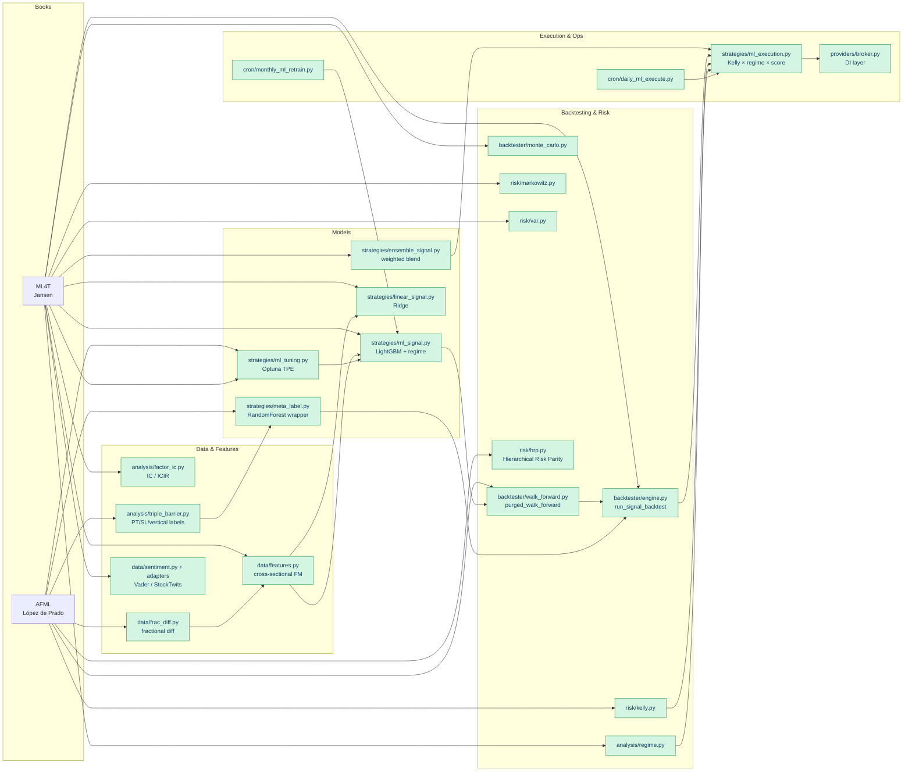

# ML Trading Book → quant-platform Feature Map

A navigation aid that cross-references chapters of two books against modules
shipped in this repository. Green nodes are implemented; amber nodes are
planned (tracked as GitHub issues); grey nodes are explicitly out of scope.

**Books**

- *Advances in Financial Machine Learning* (AFML), Marcos López de Prado, 2018
- *Machine Learning for Algorithmic Trading* (ML4T), Stefan Jansen, 2nd ed. 2020

---

## 1. Top-level map

---

## 2. Chapter-by-chapter coverage

### López de Prado — *Advances in Financial Machine Learning*

| Chapter                                      | Topic                          | Status | Module(s)                                                       |
|----------------------------------------------|--------------------------------|:------:|-----------------------------------------------------------------|
| 2 — Financial Data Structures                | tick/volume/dollar bars        |   ⏳   | _planned_ — see issue "Dollar/volume bars"                      |
| 3 — Labeling                                 | triple-barrier, meta-labeling  |   ✅   | `analysis/triple_barrier.py`, `strategies/meta_label.py`        |
| 4 — Sample Weights                           | concurrency-based weighting    |   ✅   | `analysis/sample_weights.py` (num_co_events, sample_uniqueness, sequential_bootstrap) |
| 5 — Fractionally Differentiated Features     | stationarity vs memory         |   ✅   | `data/frac_diff.py`                                             |
| 6 — Ensemble Methods                         | bagging, boosting              |   ✅   | `strategies/ensemble_signal.py`, LightGBM                       |
| 7 — Cross-Validation in Finance              | purged + embargoed K-fold      |   ✅   | `backtester/walk_forward.py:purged_walk_forward`                |
| 8 — Feature Importance                       | MDI, MDA, SFI                  |   🟡   | partial (SHAP in `ml_signal.py`); MDA planned                   |
| 9 — Hyperparameter Tuning                    | Bayesian + purged CV           |   ✅   | `strategies/ml_tuning.py` (Optuna TPE)                          |
| 10 — Bet Sizing                              | Kelly, dynamic allocation      |   ✅   | `risk/kelly.py`, `strategies/ml_execution.py`                   |
| 11 — Dangers of Backtesting                  | deflated Sharpe, PBO           |   ⏳   | _planned_ — see issue "Deflated Sharpe + PBO"                   |
| 12 — Backtesting Through Cross-Validation    | combinatorial-purged CV        |   🟡   | partial (purged WF only)                                        |
| 13 — Backtesting on Synthetic Data           | bootstrap, GAN                 |   🟡   | bootstrap in `backtester/monte_carlo.py`; GAN out of scope      |
| 14 — Backtest Statistics                     | Sharpe, Sortino, MAR           |   ✅   | `analysis/risk_metrics.py`, `backtester/engine.py`              |
| 15 — Understanding Strategy Risk             | efficient frontier, VaR        |   ✅   | `risk/markowitz.py`, `risk/var.py`                              |
| 16 — ML Asset Allocation                     | Hierarchical Risk Parity       |   ✅   | `risk/hrp.py` (quasi-diag + recursive bisection)                 |
| 17 — Structural Breaks                       | CUSUM, Chow tests              |   ⏳   | _planned_ — see issue "Structural break detection"              |
| 18 — Entropy Features                        | Shannon / plug-in / K-L        |   ⏳   | _planned_ — see issue "Entropy features"                        |
| 19 — Microstructural Features                | VPIN, Kyle λ                   |   ⏳   | _planned_ — see issue "Microstructural features"                |

### Jansen — *Machine Learning for Algorithmic Trading*

| Chapter                                      | Topic                          | Status | Module(s)                                                       |
|----------------------------------------------|--------------------------------|:------:|-----------------------------------------------------------------|
| 1 — ML for Trading                           | idea → execution               |   ✅   | architecture per `PLAN.md`                                      |
| 2 — Market & Fundamental Data                | OHLCV, adjusted prices         |   ✅   | `data/fetcher.py`, `adapters/market_data/`                      |
| 3 — Alternative Data                         | sentiment, macro               |   🟡   | `adapters/sentiment/` (Vader, StockTwits); no macro yet         |
| 4 — Financial Feature Engineering            | factors, momentum, value       |   ✅   | `data/features.py`, `strategies/indicators.py`                  |
| 5 — Portfolio Optimization & Performance     | Markowitz, efficient frontier  |   ✅   | `risk/markowitz.py`                                             |
| 6 — The Machine Learning Process             | CV, HPO, pipelines             |   ✅   | `backtester/walk_forward.py`, `strategies/ml_tuning.py`         |
| 7 — Linear Models                            | Ridge, Lasso, risk factors     |   ✅   | `strategies/linear_signal.py`                                   |
| 8 — The ML4T Workflow                        | backtest loop                  |   ✅   | `backtester/engine.py:run_signal_backtest`                      |
| 9 — Time-Series Models                       | GARCH, cointegration           |   🟡   | cointegration partial (`strategies/pairs.py` OLS); GARCH planned|
| 10 — Bayesian ML                             | Bayesian linear regression     |   ⏳   | _planned_ — see issue "Bayesian regression"                     |
| 11 — Random Forests                          | long-short strategies          |   🟡   | used internally by `meta_label.py`; no dedicated strategy       |
| 12 — Boosting                                | LightGBM / XGBoost             |   ✅   | `strategies/ml_signal.py`                                       |
| 13 — Unsupervised Learning                   | PCA, k-means, risk factors     |   ✅   | `analysis/unsupervised.py` (PCA loadings + scree; k-means on corr-distance) |
| 14 — Text Data / Sentiment Analysis          | Vader, VADER                   |   ✅   | `adapters/sentiment/vader_adapter.py`                           |
| 15 — Topic Modeling                          | LDA on news                    |   ⏳   | _planned_ — see issue "Topic modeling on news"                  |
| 16 — Word Embeddings                         | word2vec on filings            |   ⏳   | _planned_ — see issue "Word embeddings on filings"              |
| 17 — Deep Learning for Trading               | Keras / PyTorch intro          |   ⏳   | _planned_ — see issue "Deep learning alpha model"               |
| 18 — CNNs                                    | image / chart patterns         |   ⏳   | _planned_ — see issue "Deep learning alpha model"               |
| 19 — RNNs / LSTM                             | sequence models                |   ⏳   | _planned_ — see issue "Deep learning alpha model"               |
| 20 — Autoencoders                            | conditional risk factors       |   ⏳   | deferred                                                        |
| 21 — GANs                                    | synthetic time series          |   ⏳   | deferred                                                        |
| 22 — Deep Reinforcement Learning             | trading agent                  |   🟡   | `analysis/rl_sizer.py` (sizing only); no full agent             |

Legend: ✅ implemented · 🟡 partial · ⏳ planned (issue) · _blank_ deferred.

---

## 3. How to navigate

1. Find the chapter you want to apply in the tables above.
2. Click through to the referenced module to see the concrete implementation.
3. For planned items, the matching GitHub issue describes scope, reference
   section in the book, and acceptance criteria.
4. For partials (🟡) the table notes what is and isn't covered.

When adding a new feature inspired by either book, please update the
appropriate row here and link the PR.
